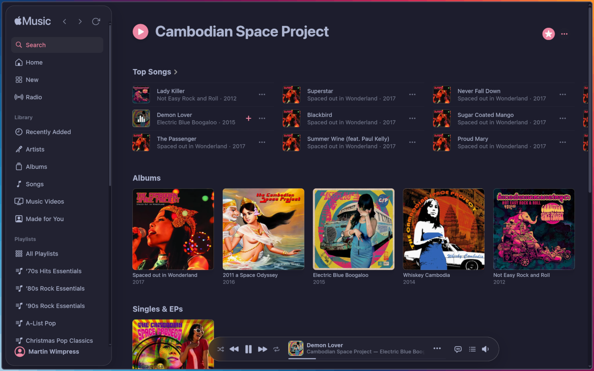

<h1 align="center">
  
  <br />
  Sidra
</h1>

<p align="center"><b>An elegant Apple Music desktop client for Linux, macOS and Windows. No frippery, just quality. A better class of Cider 🍎</b></p>

<p align="center">Made with 💝 for 🐧🍏🪟</p>

Sidra is Apple Music as a proper desktop citizen on Linux, macOS, and Windows - wired into each platform's native media subsystem, not bolted on top.

Most Apple Music desktop clients break the audio, mangle the playback controls, or bury you under a custom UI that Apple never signed off on - the problem is worst on Linux.
Sidra takes the opposite approach: wrap `music.apple.com` directly, stay out of the way, and let the audio through untouched. Apple owns the interface and keeps it current; Sidra inherits every improvement automatically.

---

## Features

- Lossless audio on macOS and Windows via [CastLabs EVS production VMP signing](https://castlabs.com/security/widevine-certification/)
- Localised storefront and interface in 32 languages
- Desktop notifications and Discord Rich Presence
- Injected Back, Forward, and Reload navigation controls
- **Linux**:
  - Widevine DRM via CastLabs Electron
  - Wayland and X11 support
  - Bi-directional MPRIS (`org.mpris.MediaPlayer2.sidra`) over D-Bus
- **macOS**:
  - Full Widevine DRM with EVS production VMP signing
  - Now Playing widget, Dock menu with playback controls, and Dock progress bar
  - App menu (Cmd+Q, About) and native share sheet for the current track
- **Windows**:
  - Full Widevine DRM with EVS production VMP signing
  - GSMTC media flyout, taskbar thumbnail toolbar (play/pause, next, previous)
  - Taskbar overlay icon and progress bar showing playback state and position
- **Application Indicator**:
  - Now Playing: track, artist, album, artwork
  - Playback controls, volume, and mute
  - Start page and last session restore, style switcher, zoom control
  - Share current track (macOS), auto-update status
- Auto-update via GitHub Releases:
  - AppImage and NSIS: silent OTA download with restart prompt; disable with `SIDRA_DISABLE_AUTO_UPDATE=1`
  - deb, rpm, Nix, macOS DMG: update notification linking to the release page

<p align="center">
  
</p>

---

> [!IMPORTANT]
> Sidra's macOS and Windows releases are currently unsigned, requiring Gatekeeper and SmartScreen workarounds at install time. [Sponsoring the project](https://github.com/sponsors/flexiondotorg) 🩷 goes directly towards code-signing certificates to remove that friction for every user.

## Install

Grab the latest release from [GitHub Releases](https://github.com/wimpysworld/sidra/releases).

### Linux

**AppImage** - runs anywhere, no installation:

```bash
chmod +x Sidra-*.AppImage && ./Sidra-*.AppImage
```

**Debian/Ubuntu**, **Fedora**, **openSUSE**:

```bash
sudo apt install ./Sidra-*.deb      # Debian/Ubuntu
sudo dnf install ./Sidra-*.rpm      # Fedora
sudo zypper install ./Sidra-*.rpm   # openSUSE
```

**Nix**:

```bash
nix profile install github:wimpysworld/sidra
```

For NixOS or Home Manager, add `github:wimpysworld/sidra` as a flake input and reference `inputs.sidra.packages.<system>.default`.

### macOS

**DMG** - open and drag Sidra to Applications.

The app is unsigned, so Gatekeeper blocks the first launch. Either remove the quarantine attribute:

```bash
xattr -d com.apple.quarantine /Applications/Sidra.app
```

Or open System Settings → Privacy & Security and click **Open Anyway** after the first blocked attempt.

**Nix**:

```bash
nix profile install github:wimpysworld/sidra
```

### Windows

**Installer** (`.exe`) - run and follow the prompts.

SmartScreen will warn the installer is unsigned. Click **More info** then **Run anyway**.

---

## How It Works

Sidra loads `music.apple.com` directly inside CastLabs Electron (required for Widevine DRM on Linux - no other shell supports this).
A lightweight hook script is injected after page load that taps `MusicKit.getInstance()` events and forwards them over Electron IPC to the main process, which distributes them to platform integrations.

```
music.apple.com
  └── MusicKit.js events
        └── musicKitHook.js (injected)
              └── IPC → player.ts (EventEmitter)
                    ├── MPRIS (Linux, dbus-next, D-Bus session bus)
                    ├── Discord Rich Presence
                    ├── Desktop notifications
                    ├── navigator.mediaSession (macOS/Windows)
                    ├── Dock menu + progress bar (macOS)
                    └── Taskbar toolbar + overlay + progress bar (Windows)
```

Controls flow in reverse: MPRIS method calls reach `window.__sidra` via `webContents.executeJavaScript()`, which calls the appropriate MusicKit method directly.

The codebase is tightly focused and as lean as possible.

---

## Why Sidra?

I used [Cider](https://cider.sh/) for years, but as time passed and the weight of new features grew the core experience degraded.

Cider hardcodes a 96kHz `AudioContext`, so every track Apple delivers at 44.1 or 48kHz gets resampled up, then back down to whatever the hardware expects. Twice, needlessly. All audio routes through a DSP chain regardless of your settings - the "Cider Adrenaline Processor" markets itself as making lossy audio sound lossless, but it is biquad EQ shaping and cannot recover discarded information. Common advice in the community is to simply turn it off.

Reliability followed the same arc. Authentication reported failure after succeeding. Tracks stopped for no reason. Volume reset mid-session. On Linux, MPRIS volume never worked right because Cider's audio engine sat between the system volume curve and the actual output. These were not new bugs; they were architectural, and the architecture was load-bearing.

I wanted something that just worked. So, I made Sidra.

**Linux came first.** Every existing Apple Music client either lacks MPRIS, implements it badly, or wrecks the audio in the process. Media keys should work. Desktop notifications should fire. Volume should track. None of that is exotic, and none of it should require a custom audio engine.

**macOS followed, for two reasons.** Devices enrolled in MDM can block personal Apple ID authentication - the native app simply refuses to sign in. Sidra authenticates at the application layer, a glorified browser session, so MDM policy never sees it. Then there is the more relatable problem: a friend's daughter was steadily polluting his Apple Music recommendations with K-pop. Sidra installed alongside the native app gives her a fully isolated session - her listening history, her "For You" shelf, her algorithmic rabbit holes. His recommendations are his own again.

**Windows followed** at the request of another friend who wanted a decent Apple Music client that was not Cider.

The bonus became clear once everything was working. Wrapping `music.apple.com` directly means none of those failure modes can exist. Apple's audio pipeline, Apple's auth, Apple's UI - Sidra never creates an `AudioContext`. Audio flows untouched through Chromium's media stack to the OS. Authentication cannot drift out of sync with Apple's servers. The interface updates whenever Apple ships a change, automatically.

*Sidra* is the Spanish word for the traditional dry cider of Asturias in northern Spain - poured from height, unfiltered, drunk before it goes flat. The name came from a trip to the region for UbuCon Europe 2018. No additives, no artifice, nothing between the apple and the glass.

---

## Development

Requires [Nix](https://nixos.org/) with flakes enabled. [direnv](https://direnv.net/) is recommended. The project uses npm and TypeScript with [CastLabs Electron](https://github.com/castlabs/electron-releases) (`wvcus` variant) - standard Electron cannot be substituted as it lacks Widevine DRM support on Linux.

```bash
direnv allow          # or: nix develop
just install          # install npm dependencies
just run              # build and launch
```

Sign in on first launch; your session persists across relaunches. Run `just` with no arguments to list all available recipes for building, testing, debugging, and diagnostics.

### Widevine VMP signing

Widevine enforces VMP (Verified Media Path) production signing on macOS and Windows - without it, Apple Music returns "Something went wrong" after login. CastLabs ECS ships with development keys; production signing requires a free [CastLabs EVS](https://github.com/castlabs/electron-releases/wiki/EVS) account.

**One-time setup:**

```bash
uvx --from castlabs-evs evs-account signup
```

Credentials are stored at `~/.config/evs/config.json`. The account is portable - use `evs-account reauth` on any new machine.

| Context | Credentials |
|---------|-------------|
| Local machine | `~/.config/evs/config.json`; or set `EVS_ACCOUNT_NAME` + `EVS_PASSWD` env vars (e.g. via sops-nix) |

`just install` and `just build` sign the local Electron binary automatically once credentials are in place. Release builds are signed via the `afterPack` hook in `build/afterPack.cjs`.

See [`docs/SPECIFICATION.md`](docs/SPECIFICATION.md) for full technical detail: architecture, IPC event flow, MPRIS property checklist, platform media control implementation, and the complete feature inventory.

Security audits run after significant feature work. The current report, including full remediation history, is at [`docs/SECURITY-REPORT.md`](docs/SECURITY-REPORT.md).
