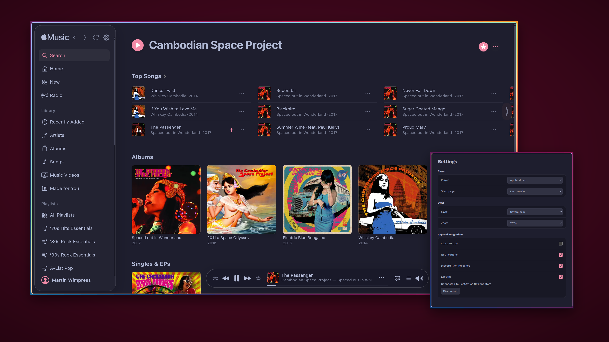
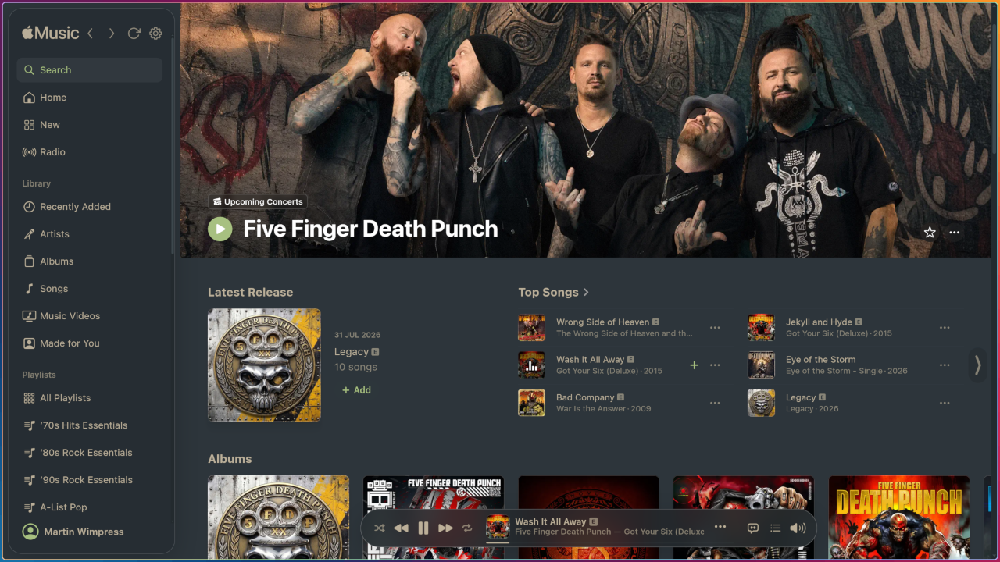
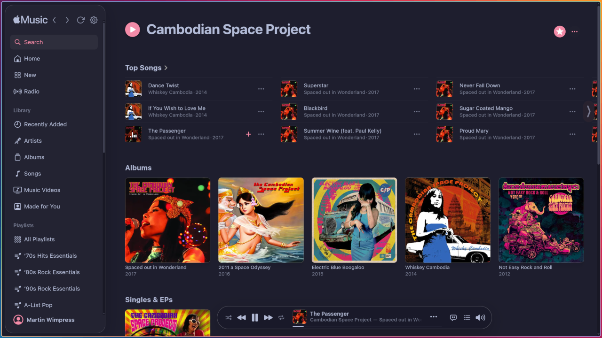
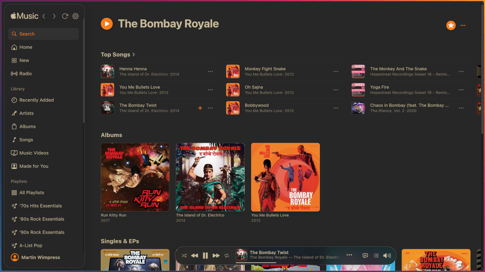
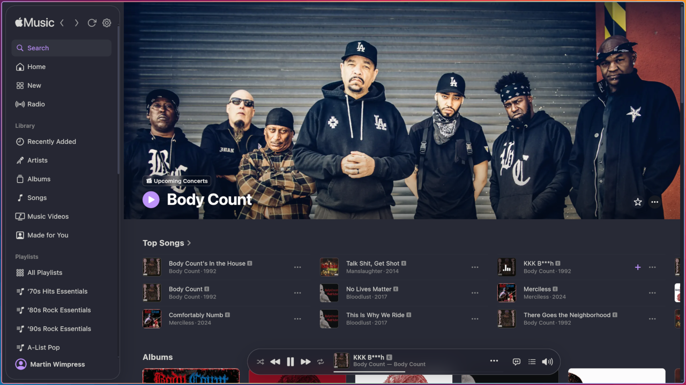

<h1 align="center">
  
  <br />
  Sidra
</h1>

<p align="center"><b>An elegant Apple Music desktop client for Linux, macOS and Windows. No frippery, just quality. A better class of Cider 🍎</b></p>

<p align="center">Made with 💝 for 🐧🍏🪟</p>

Sidra is Apple Music as a proper desktop citizen on Linux, macOS, and Windows - wired into each platform's native media subsystem, not bolted on top.

Most Apple Music desktop clients break the audio, mangle the playback controls, or bury you under a custom UI that Apple never signed off on - the problem is worst on Linux.
Sidra takes the opposite approach: wrap `music.apple.com` directly, stay out of the way, and let the audio through untouched. Apple owns the interface and keeps it current; Sidra inherits every improvement automatically.

<p align="center">
  <a href="assets/sidra-screenshot.png"></a>
</p>

## Features

- 🎧 **Untouched audio** - no `AudioContext`, no DSP, no resampling; lossless on macOS and Windows via [CastLabs EVS production VMP signing](https://castlabs.com/security/widevine-certification/)
- 🎨 **Eight bundled themes** - Catppuccin, Dracula, Everforest, Gruvbox, Nord, Rosé Pine, Solarized, and Tokyo Night - plus a live-reloading custom colour theme
- 📊 **Last.fm scrobbling** - opt-in, with browser approval
- 🎮 **Discord Rich Presence** - show what you are listening to
- 🔔 **Desktop notifications** - track changes with Previous and Next controls where the platform supports notification actions
- 🌍 **32 languages** - localised storefront and interface
- 🧭 **Back, Forward, and Reload** - injected into both Apple Music and Apple Music Classical
- 🎮 **Controller navigation** - use a standard controller to move through and select items in both services
- 🖱️ **Scroll to change volume** - point at the player bar volume control and scroll; 5% a notch
- 🎼 **Apple Music Classical** - switch at runtime through **Player** in Settings or the tray:
  - Start pages are Home, Browse, Playlists, Search, or your last page; Apple Music's are Home, New, Radio, All Playlists, or your last page
- 🐧 **Linux**:
  - Widevine DRM via CastLabs Electron
  - Wayland and X11 support
  - Bi-directional MPRIS (`org.mpris.MediaPlayer2.sidra`) over D-Bus
- 🍏 **macOS**:
  - Full Widevine DRM with EVS production VMP signing
  - Now Playing widget, Dock menu with playback controls, and Dock progress bar
  - App menu (Cmd+Q, About) and native share sheet for the current track
- 🪟 **Windows**:
  - Full Widevine DRM with EVS production VMP signing
  - GSMTC media flyout, taskbar thumbnail toolbar (play/pause, next, previous)
  - Taskbar overlay icon and progress bar showing playback state and position
- 🎚️ **Application Indicator**:
  - Now Playing: track, artist, album, artwork
  - Playback controls, volume, and mute
  - Start page and last session restore, style switcher, zoom control
  - Close to tray, opt-in: closing the window keeps Sidra running, with Hide and Show entries
  - Share current track (macOS), auto-update status
- 🔄 **Auto-update** via GitHub Releases:
  - AppImage and NSIS: silent OTA download with restart prompt; disable with `SIDRA_DISABLE_AUTO_UPDATE=1`
  - deb, rpm, Nix, macOS DMG: update notification linking to the release page

Open **Settings** with the gear button beside Back, Forward and Reload.
With the player focused, press <kbd>Ctrl</kbd>+<kbd>,</kbd> on Linux or Windows, or <kbd>Cmd</kbd>+<kbd>,</kbd> on macOS.
The resizable window contains player, start page, style, zoom, close-to-tray, notification, Discord and Last.fm preferences.
Changes save immediately. The existing tray preferences remain available. [View Settings screenshot](assets/source/sidra-settings.png).

Track notifications let you select **Previous** or **Next** without opening Sidra. Click the notification body to show the player.
On Linux, the controls and body click require a notification service that supports actions. On macOS, the controls require a signed app and alert-style notifications.
The current unsigned macOS releases do not meet that requirement.

### As seen in

<table align="center">
  <tr>
    <td align="center">
      <a href="https://linuxmatters.sh/79/"></a><br>
      <a href="https://linuxmatters.sh/79/">Episode 79: Pouring out the Sidra</a>
    </td>
    <td align="center">
      <a href="https://www.linux-magazin.de/news/sidra-1-0-bringt-apple-music-auf-den-linux-desktop/"></a><br>
      <a href="https://www.linux-magazin.de/news/sidra-1-0-bringt-apple-music-auf-den-linux-desktop/">Sidra 1.0 on the Linux desktop</a> (German)
    </td>
  </tr>
</table>

I am a presenter on Linux Matters and discussed Sidra's origins in Episode 79. Linux Magazin Online covers Sidra 1.0 and includes an interview with me.

---

> [!IMPORTANT]
> Sidra's macOS and Windows releases are currently unsigned, requiring Gatekeeper and SmartScreen workarounds at install time. [Sponsoring the project](https://github.com/sponsors/flexiondotorg) 🩷 goes directly towards code-signing certificates to remove that friction for every user.

## Install

Grab the latest release from [GitHub Releases](https://github.com/wimpysworld/sidra/releases).

### Linux

Linux builds ship for x86_64 and arm64. Pick the file that matches your CPU: `Sidra-linux-x86_64.AppImage` or `Sidra-linux-arm64.AppImage`, `-linux-amd64.deb` or `-linux-arm64.deb`, `.x86_64.rpm` or `.aarch64.rpm`. The arm64 builds are made natively on `ubuntu-24.04-arm` runners and update from the release like the x86_64 ones. The snap is published for both, so `snap install sidra` picks the right one.

**AppImage**

On Debian 13 (Trixie) and Ubuntu 24.04 or newer, install the AppImage FUSE dependency first:

```bash
sudo apt install libfuse2t64
```

Runs anywhere, no installation:

```bash
chmod +x Sidra-*.AppImage && ./Sidra-*.AppImage
```

**Debian/Ubuntu**

Use the `.deb` package unless you need AppImage:

```bash
sudo apt install ./Sidra-*.deb
```

**Fedora/openSUSE**

```bash
sudo dnf install ./Sidra-*.rpm      # Fedora
sudo zypper install ./Sidra-*.rpm   # openSUSE
```

**Snap** - Ubuntu and other snapd-enabled distributions:

```bash
sudo snap install sidra
```

**AUR** - Arch Linux and derivatives:

```bash
yay -S sidra-bin
```

**Nix**:

With flakes enabled, install Sidra for your user:

```bash
nix profile add github:wimpysworld/sidra
```

For NixOS or Home Manager, add Sidra to your `flake.nix` inputs:

```nix
inputs.sidra.url = "github:wimpysworld/sidra";
```

**NixOS**:

```nix
environment.systemPackages = [
  inputs.sidra.packages.${pkgs.stdenv.hostPlatform.system}.default
];
```

**Home Manager**:

```nix
home.packages = [
  inputs.sidra.packages.${pkgs.stdenv.hostPlatform.system}.default
];
```

These module snippets need `inputs` in their function arguments, passed through NixOS `specialArgs` or Home Manager `extraSpecialArgs`.
For Home Manager inside NixOS, use `home-manager.extraSpecialArgs`.

### macOS

**DMG** - open and drag Sidra to Applications.

> [!WARNING]
> On first launch macOS may report:
> _"Sidra.app" is damaged and can't be opened. You should move it to the Bin._
> The app is unsigned, not corrupt. macOS shows this because the download is quarantined.

Strip the quarantine attribute in Terminal, then open Sidra normally:

```bash
xattr -dr com.apple.quarantine /Applications/Sidra.app
```

System Settings → Privacy & Security only offers **Open Anyway** for the milder "unidentified developer" prompt, never for "damaged" - so Terminal is the dependable path.

### Windows

**Installer** (`.exe`) - run and follow the prompts.

SmartScreen will warn the installer is unsigned. Click **More info** then **Run anyway**.

---

## Theming

Choose **Style** in Settings. Sidra ships with **Catppuccin**, **Dracula**, **Everforest**, **Gruvbox**, **Nord**, **Rosé Pine**, **Solarized**, and **Tokyo Night**, plus the default **Apple Music** styling.

These theme examples show different artist pages. Select an image to view the full-resolution screenshot.

| Rosé Pine | Catppuccin |
|---|---|
| [](assets/source/sidra-screenshot-01@2x.png) | [](assets/source/sidra-screenshot-02@2x.png) |
| **Gruvbox** | **Dracula** |
| [](assets/source/sidra-screenshot-03@2x.png) | [](assets/source/sidra-screenshot-04@2x.png) |

Your chosen theme applies to Apple Music, Apple Music Classical and Settings.

### Custom theme

Copy [custom-theme.json](docs/custom-theme.json) to Sidra's user data directory, then edit its colours:

| Platform | File |
|---|---|
| Linux | `~/.config/Sidra/custom-theme.json` |
| macOS | `~/Library/Application Support/Sidra/custom-theme.json` |
| Windows | `%APPDATA%\Sidra\custom-theme.json` |

On Linux, a set `XDG_CONFIG_HOME` replaces `~/.config`.

A valid file adds one **Custom Theme** choice under **Style** in Settings.
Select it once. Saved edits apply without a restart, including in an open Settings window.

The example contains all 12 required colours in `dark`:

```json
{
  "dark": {
    "base": "#1e1e2e",
    "mantle": "#181825",
    "crust": "#11111b",
    "surface0": "#313244",
    "surface1": "#45475a",
    "surface2": "#585b70",
    "overlay": "#6c7086",
    "text": "#cdd6f4",
    "subtext1": "#bac2de",
    "subtext0": "#a6adc8",
    "accent": "#f38ba8",
    "accentHover": "#eba0ac"
  }
}
```

Use six-digit hex colours, such as `#1e1e2e`. JSON requires double quotes and accepts no comments or trailing commas.
For a separate light scheme, add a `light` object with the same 12 keys. Without it, Sidra uses `dark` in both modes.

| Keys | Colour role |
|---|---|
| `base`, `mantle`, `crust` | Page, player and footer backgrounds |
| `surface0`, `surface1`, `surface2` | Controls, scrollbars and borders |
| `text`, `subtext1`, `subtext0`, `overlay` | Primary, secondary, emphasised secondary and tertiary text |
| `accent`, `accentHover` | Highlight colour and its hover or pressed state |

Sidra accepts low-contrast palettes without adjustment. Choose colours that you can read comfortably.
Custom themes change colours only, not fonts or layout.

If the file is missing, unreadable or invalid, **Custom Theme** disappears and an active custom theme falls back to **Apple Music**.
Fix or restore the file to recover the theme automatically, unless you selected another style.

**Migrating from custom CSS:** Sidra ignores existing `custom.css` files but leaves them untouched.
Copy your colours into the JSON example. Sidra cannot automatically convert arbitrary CSS, and CSS rules no longer apply.

## Mini Player

Sidra ships no mini player and does not need one. Christian Lauinger ([@ChrisLauinger77](https://github.com/ChrisLauinger77)) asked for one in [#125](https://github.com/wimpysworld/sidra/issues/125), then built [**MPRIS MiniPlayer**](https://github.com/ChrisLauinger77/mpris-miniplayer): a small GTK4/libadwaita window that controls any MPRIS player on Linux.

It pairs beautifully with **Close to tray**. Hide the Sidra window, keep the mini player on top, and place it anywhere on your desktop. Thank you, Christian 🙏

## Controller navigation

Sidra supports controllers that expose the browser's standard Gamepad mapping. The controls work in Apple Music and Apple Music Classical:

| Controller input | Action |
|---|---|
| D-pad | Move up, down, left, or right |
| A button | Select the focused item |
| B button | Go back when navigation history permits |

Hold a D-pad direction to repeat it. The A and B buttons act once per press. Controller input does not control media playback or settings.

## Last.fm scrobbling

Nothing is sent to Last.fm until you connect an account. In Settings, choose **Connect to Last.fm…**, then approve Sidra in your browser. Settings and the tray show your username after approval. Sidra also sends a notification if notifications are on.

Use Settings or the tray **Last.fm** submenu to turn scrobbling on or off, or disconnect. You can also connect through that submenu. Sidra sends the now-playing track when playback starts or resumes, and scrobbles it once it has played for half its length or four minutes, whichever comes first. Tracks of 30 seconds or less never scrobble - that is Last.fm's rule, not Sidra's. When a scrobble cannot reach Last.fm, Sidra holds the play and sends it with the next one that gets through, so a dropped connection does not cost you it.

Sidra also scrobbles individual songs from live radio and archived shows. Radio songs have no reported duration, so they scrobble after four minutes of active playback. A song can scrobble at the next confirmed song change if Sidra observed its start and more than 30 seconds of playback. The first song joined part-way through uses the four-minute fallback.

Connecting stores a Last.fm session key and your username in Sidra's configuration file, in plain text:

- Linux: `~/.config/Sidra/config.json`
- macOS: `~/Library/Application Support/Sidra/config.json`
- Windows: `%APPDATA%\Sidra\config.json`

> [!IMPORTANT]
> Last.fm session keys never expire, and the Last.fm API has no call to revoke one. **Disconnect** deletes Sidra's copy of the key, which stops this installation scrobbling, but only Last.fm can invalidate the key itself. Remove Sidra under [Applications in your Last.fm settings](https://www.last.fm/settings/applications) to do that. Sidra notices the revoked session on its next request, disconnects, and tells you.

What Sidra sends is listed in [`docs/LASTFM-PRIVACY.md`](docs/LASTFM-PRIVACY.md).

---

## Why Sidra?

I used [Cider](https://cider.sh/) for years, but as time passed and the weight of new features grew the core experience degraded.

Cider hardcodes a 96kHz `AudioContext`, so every track Apple delivers at 44.1 or 48kHz gets resampled up, then back down to whatever the hardware expects. Twice, needlessly. All audio routes through a DSP chain regardless of your settings - the "Cider Adrenaline Processor" markets itself as making lossy audio sound lossless, but it is biquad EQ shaping and cannot recover discarded information. Common advice in the community is to simply turn it off.

Reliability followed the same arc. Authentication reported failure after succeeding. Tracks stopped for no reason. Volume reset mid-session. On Linux, MPRIS volume never worked right because Cider's audio engine sat between the system volume curve and the actual output. These were not new bugs; they were architectural, and the architecture was load-bearing.

I wanted something that just worked. So, I made Sidra.

**Linux came first.** Every existing Apple Music client either lacks MPRIS, implements it badly, or wrecks the audio in the process. Media keys should work. Desktop notifications should fire. Volume should track. None of that is exotic, and none of it should require a custom audio engine.

**macOS followed, for two reasons.** Devices enrolled in MDM can block personal Apple ID authentication - the native app simply refuses to sign in. Sidra authenticates at the application layer, a glorified browser session, so MDM policy never sees it. Then there is the more relatable problem: a friend's daughter was steadily polluting his Apple Music recommendations with K-pop. Sidra installed alongside the native app gives her a fully isolated session - her listening history, her "For You" shelf, her algorithmic rabbit holes. His recommendations are his own again.

**Windows followed** at the request of another friend who wanted a decent Apple Music client that was not Cider.

The bonus became clear once everything was working. Wrapping `music.apple.com` directly means none of those failure modes can exist. Apple's audio pipeline, Apple's auth, Apple's UI - Sidra never creates an `AudioContext`. Audio flows untouched through Chromium's media stack to the OS. Authentication cannot drift out of sync with Apple's servers. The interface updates whenever Apple ships a change, automatically.

*Sidra* is the Spanish word for the traditional dry cider of Asturias in northern Spain - poured from height, unfiltered, drunk before it goes flat. The name came from a trip to the region for UbuCon Europe 2018. No additives, no artifice, nothing between the apple and the glass.

### How It Works

Sidra loads `music.apple.com` directly inside CastLabs Electron (required for Widevine DRM on Linux - no other shell supports this).
A lightweight hook script is injected after page load that taps `MusicKit.getInstance()` events and forwards them over Electron IPC to the main process, which distributes them to platform integrations.

```
music.apple.com
  └── MusicKit.js events
        └── musicKitHook.js (injected)
              └── IPC → player.ts (EventEmitter)
                    ├── MPRIS (Linux, dbus-next, D-Bus session bus)
                    ├── Discord Rich Presence
                    ├── Last.fm scrobbling
                    ├── Desktop notifications
                    ├── navigator.mediaSession (macOS/Windows)
                    ├── Dock menu + progress bar (macOS)
                    └── Taskbar toolbar + overlay + progress bar (Windows)
```

Controls flow in reverse: MPRIS method calls reach `window.__sidra` via `webContents.executeJavaScript()`, which calls the appropriate MusicKit method directly.

The codebase is tightly focused and as lean as possible.

---

## Development

Requires [Nix](https://nixos.org/) with flakes enabled. [direnv](https://direnv.net/) is recommended. The project uses npm and TypeScript with [CastLabs Electron](https://github.com/castlabs/electron-releases) (`wvcus` variant) - standard Electron cannot be substituted as it lacks Widevine DRM support on Linux.

```bash
direnv allow          # or: nix develop
just install          # install npm dependencies
just run              # build and launch
```

Sign in on first launch; your session persists across relaunches. Run `just` with no arguments to list all available recipes for building, testing, debugging, and diagnostics.

Run `just generate-assets` to regenerate application icons, the logo, DMG backgrounds, tray icons and menu icons from SVG sources.
The command also composes the README image from screenshots.

### Widevine VMP signing

Widevine enforces VMP (Verified Media Path) production signing on macOS and Windows - without it, Apple Music returns "Something went wrong" after login. CastLabs ECS ships with development keys; production signing requires a free [CastLabs EVS](https://github.com/castlabs/electron-releases/wiki/EVS) account.

**One-time setup:**

```bash
uvx --from castlabs-evs evs-account signup
```

Credentials are stored at `~/.config/evs/config.json`. The account is portable - use `evs-account reauth` on any new machine.

| Context | Credentials |
|---------|-------------|
| Local machine | `~/.config/evs/config.json`; or set `EVS_ACCOUNT_NAME` + `EVS_PASSWD` env vars (e.g. via sops-nix) |

`just install` and `just build` sign the local Electron binary automatically once credentials are in place. Release builds are signed via the `afterPack` hook in `build/afterPack.cjs`.

### Last.fm API credentials

Official releases ship Last.fm API credentials. A build from this repository does not. Without credentials, Settings and the tray hide the Last.fm controls.

Register an API account at [last.fm/api/account/create](https://www.last.fm/api/account/create), then export the key and secret before building:

```bash
export SIDRA_LASTFM_API_KEY=your-api-key
export SIDRA_LASTFM_API_SECRET=your-shared-secret
just run
```

| Context | Credentials |
|---------|-------------|
| Local machine | `SIDRA_LASTFM_API_KEY` + `SIDRA_LASTFM_API_SECRET` env vars (e.g. via direnv or sops-nix) |
| Packaged build | `assets/lastfm-credentials.json`, written from those env vars by `just build` and `npm run build` |
| CI | The same two names as repository secrets |

Environment variables win at runtime; the JSON file is the fallback that packaged builds use. That file is gitignored - the shared secret must never be committed. With neither variable set the build writes it empty, unless it already holds credentials, in which case it is left alone.

See [`docs/SPECIFICATION.md`](docs/SPECIFICATION.md) for full technical detail: architecture, IPC event flow, MPRIS property checklist, platform media control implementation, and the complete feature inventory.

Dependency security is tracked in the open. [Dependabot alerts](https://github.com/wimpysworld/sidra/security/dependabot) carries the live state of every advisory affecting Sidra, and fixes are merged as they land. A live page beats a report checked into the repository, which is stale the day after it is written. GitHub restricts that page to repository maintainers.

Private vulnerability reporting is enabled. To report a security issue, follow [`SECURITY.md`](SECURITY.md) - your report stays between you and the maintainers until a fix ships.
